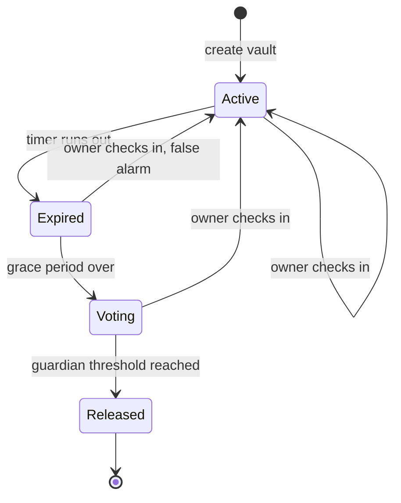

[README (2).md](https://github.com/user-attachments/files/33192967/README.2.md)
<div align="center">


<a href="https://github.com/tarunt-07/PulseVault">
  
</a>

<br/>


### 💓 A decentralized digital will. A dead man's switch that lives on-chain.

**[Overview](#-what-is-pulsevault)** · **[How It Works](#-how-it-works)** · **[Features](#-features)** · **[Architecture](#-architecture)** · **[Tech Stack](#-tech-stack)** · **[Getting Started](#-getting-started)** · **[Roadmap](#-roadmap)** · **[Team](#-team)**

</div>

---

## 🧠 What is PulseVault?

Billions in crypto and countless irreplaceable files are lost forever when their owner passes away: lost seed phrases, locked drives, forgotten passwords.

**PulseVault** fixes this with a **blockchain smart contract acting as a dead man's switch**:

- 🔐 Your files are **encrypted in your browser** and your keys stay locked in the vault.
- 💓 You **check in on a schedule** to prove you're alive. As long as you do, the vault stays sealed and private.
- ⏳ If the timer expires, a **pre-selected group of trusted guardians** is asked to vote on whether you have passed away.
- ✅ Once guardians reach consensus, the contract **automatically releases the decryption keys exclusively to your chosen beneficiary**.

No lawyers. No middlemen. No single point of failure. Just code that keeps its promise.

---

## ⚡ How It Works

| Step | Who | What happens |
|:---:|:---|:---|
| **1** | 🧑 Owner | Uploads files, which are **encrypted client-side** and stored on IPFS |
| **2** | 🧑 Owner | Picks a **beneficiary**, **guardians**, a **vote threshold** and a **check-in interval** |
| **3** | 🧑 Owner | Calls `checkIn()` regularly, and each check-in **resets the timer** |
| **4** | ⏰ Contract | Timer expires, and the vault enters the **Expired** state |
| **5** | 🛡 Guardians | Vote to confirm the owner's passing, and any owner check-in cancels the process |
| **6** | 🎁 Beneficiary | Threshold reached, so they **claim the key** and decrypt the files |

### 🔄 Vault lifecycle



### 📡 End-to-end flow


---

## ✨ Features

- 💓 **Dead man's switch**: configurable check-in interval enforced by the smart contract
- 🛡 **Guardian consensus**: M-of-N voting so no single person can trigger a release
- 🎯 **Beneficiary-only release**: only the chosen address can claim the key
- 🔒 **Client-side encryption**: plaintext never leaves your browser
- 🌐 **Decentralized storage**: encrypted files live on IPFS, not on our servers
- ⏱ **Grace period**: a buffer after expiry that protects against accidental triggers
- ↩ **Owner override**: checking in at any point before release cancels the vote
- 📜 **Transparent and auditable**: every check-in, vote and release is an on-chain event

---

## 🧱 Architecture

```text
┌──────────────┐    encrypt     ┌──────────────┐   ciphertext   ┌─────────┐
│   Owner UI   │ ─────────────▶ │  Web Crypto  │ ─────────────▶ │  IPFS   │
│ (React/Vite) │                │ AES-256-GCM  │                └─────────┘
└──────┬───────┘                └──────┬───────┘
       │ ethers.js                     │ wrapped key (encrypted to beneficiary)
       ▼                               ▼
┌─────────────────────────────────────────────┐
│       PulseVault Smart Contract (EVM)       │
│  checkIn · vote · threshold · release logic │
└──────┬───────────────────────────┬──────────┘
       │ events                    │ claim
       ▼                           ▼
┌──────────────┐            ┌──────────────┐
│  Guardians   │            │ Beneficiary  │
└──────────────┘            └──────────────┘
```

### 🔐 Security model

- The file key is **never stored in plaintext on-chain**. It is wrapped (encrypted) with the **beneficiary's public key**, and the contract only controls *when* the wrapped key becomes claimable.
- Guardians **never see the key or the files**. They only vote.
- Voting needs a **threshold of guardians**, and the owner can cancel by checking in.

> **Disclaimer:** PulseVault is an academic prototype built for learning. It is **unaudited**, so use **testnets only** and do not store real funds or sensitive secrets.

---

## 🧰 Tech Stack

| Layer | Technology |
|:---|:---|
| 📜 Smart Contracts | Solidity, Hardhat, OpenZeppelin |
| 🌐 Frontend | React, Vite, Tailwind CSS |
| 🔗 Web3 | ethers.js, MetaMask |
| 🔐 Encryption | Web Crypto API (AES-256-GCM), ECIES key wrapping |
| 📦 Storage | IPFS (Pinata) |
| 🧪 Testing | Hardhat, Chai, Mocha |
| ⛓ Network | Ethereum Sepolia Testnet |

---

## 📁 Project Structure

```text
PulseVault/
├── contracts/          # Solidity smart contracts
│   └── PulseVault.sol
├── test/               # Contract tests
├── scripts/            # Deploy and utility scripts
├── frontend/           # React + Vite dApp
├── docs/               # Diagrams, reports, slides
├── hardhat.config.js
├── .env.example
└── README.md
```

---

## 🚀 Getting Started

> The project is under active development. The commands below show the planned setup and may change.

### Prerequisites

- Node.js 18+
- MetaMask wallet with Sepolia test ETH
- Pinata account for IPFS

### Installation

```bash
# 1. Clone the repo
git clone https://github.com/tarunt-07/PulseVault.git
cd PulseVault

# 2. Install dependencies
npm install
cd frontend && npm install && cd ..

# 3. Set up environment variables
cp .env.example .env
# fill in SEPOLIA_RPC_URL, PRIVATE_KEY, PINATA_JWT

# 4. Compile and test the contracts
npx hardhat compile
npx hardhat test

# 5. Deploy to Sepolia
npx hardhat run scripts/deploy.js --network sepolia

# 6. Start the frontend
cd frontend && npm run dev
```

### Contract interface (planned)

| Function | Caller | Purpose |
|:---|:---|:---|
| `createVault(...)` | Owner | Set beneficiary, guardians, threshold, interval, wrapped key and CID |
| `checkIn()` | Owner | Prove you're alive and reset the timer |
| `startVoting()` | Anyone | Open voting once the timer and grace period have passed |
| `castVote(bool)` | Guardian | Confirm or reject the owner's passing |
| `claim()` | Beneficiary | Receive the wrapped key and CID after consensus |

---

## 🧭 Roadmap

- [ ] Finalize architecture and contract design
- [ ] Smart contract: vault creation and check-in timer
- [ ] Smart contract: guardian voting and threshold logic
- [ ] Smart contract: beneficiary claim and release
- [ ] Full test suite with edge cases
- [ ] Client-side encryption and key wrapping
- [ ] IPFS upload and retrieval
- [ ] Frontend dashboard for owner, guardian and beneficiary
- [ ] Check-in reminders by email or Telegram
- [ ] Sepolia deployment and demo
- [ ] Project report and presentation

---

## 👥 Team

| Name | Registration No. | GitHub |
|:---|:---:|:---|
| Your Name | 25BCE5485 | [@tarunt-07](https://github.com/tarunt-07) |
| Teammate 2 | 25BCE5627 | [@username](https://github.com/username) |
| Teammate 3 | 25BCE5705 | [@username](https://github.com/username) |

Built at **VIT Chennai**, B.Tech Computer Science and Engineering.

---

## 🤝 Contributing

Ideas, issues and PRs are welcome. Fork the repo, create a branch such as `feat/your-feature`, commit using [Conventional Commits](https://www.conventionalcommits.org/) and open a pull request.

## 📄 License

Distributed under the **MIT License**. See [`LICENSE`](./LICENSE) for details.

---

<div align="center">

### 💓 If PulseVault resonates with you, drop a ⭐ to keep the heartbeat going.


</div>
