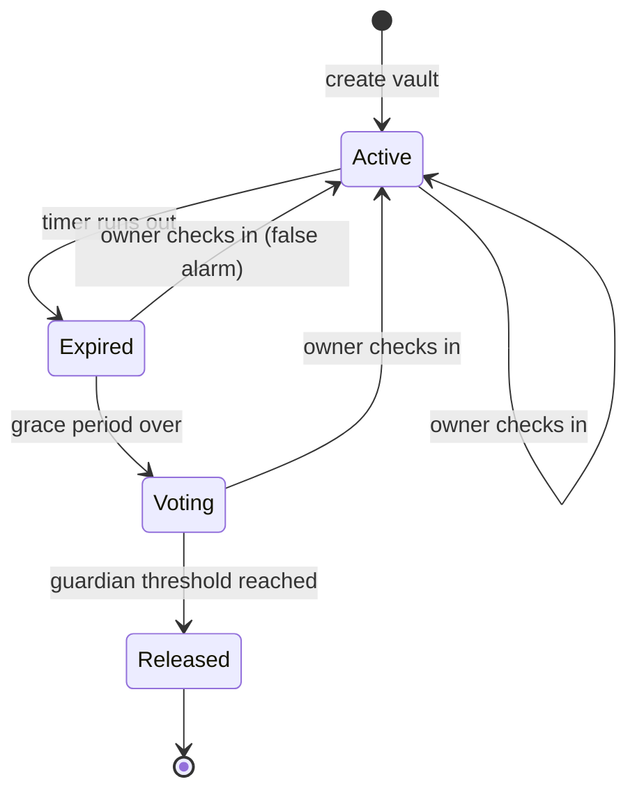
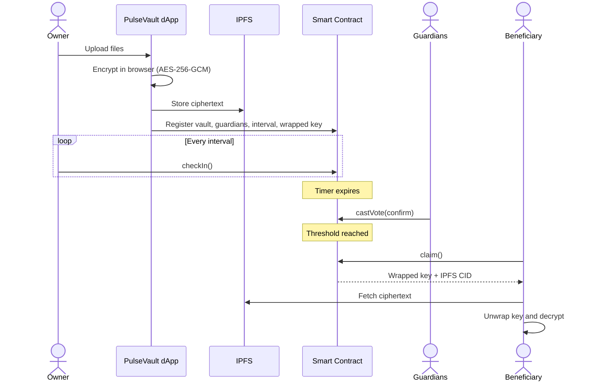

<svg xmlns="http://www.w3.org/2000/svg" viewBox="0 0 1200 320" width="1200" height="320" role="img" aria-label="PulseVault banner" xmlns:c2pa="http://c2pa.org/manifest"><metadata><c2pa:manifest>AAAWgmp1bWIAAAAeanVtZGMycGEAEQAQgAAAqgA4m3EDYzJwYQAAABZcanVtYgAAAEdqdW1kYzJtYQARABCAAACqADibcQN1cm46YzJwYTo5NzFlMjZiOC04OWI2LTQ3ZjEtYjZhYi1jYzllYzQ5NzQyOTQAAAADl2p1bWIAAAApanVtZGMyYXMAEQAQgAAAqgA4m3EDYzJwYS5hc3NlcnRpb25zAAAAALxqdW1iAAAARGp1bWRjYm9yABEAEIAAAKoAOJtxE2MycGEuaW5ncmVkaWVudC52MwAAAAAYYzJzaIn2IAJ0VltowP8ZzeTv2EUAAABwY2JvcqNpZGM6Zm9ybWF0bWltYWdlL3N2Zyt4bWxqaW5zdGFuY2VJRHgseG1wOmlpZDozNTgyOWM3NC1iZDVjLTRlODItODI5YS04NzQ3MTBkOGYxZDZscmVsYXRpb25zaGlwaHBhcmVudE9mAAAB4mp1bWIAAABBanVtZGNib3IAEQAQgAAAqgA4m3ETYzJwYS5hY3Rpb25zLnYyAAAAABhjMnNoGVlXm3OfpuAr1GsvhNDGMQAAAZljYm9yomdhY3Rpb25zgqJmYWN0aW9ua2MycGEub3BlbmVkanBhcmFtZXRlcnOha2luZ3JlZGllbnRzgaJjdXJseC1zZWxmI2p1bWJmPWMycGEuYXNzZXJ0aW9ucy9jMnBhLmluZ3JlZGllbnQudjNkaGFzaFggk6ZJKyYixMH3AhvdSMllrDFFVjG7dAUf6Dv+8lLIV1mkZmFjdGlvbngdY29tLmFudGhyb3BpYy5jbGF1ZGUucHJvdmlkZWRqcGFyYW1ldGVyc6F4H2NvbS5hbnRocm9waWMub3JpZ2luLWNvbmZpZGVuY2VndW5rbm93bmtkZXNjcmlwdGlvbnhmQ2xhdWRlIHByb3ZpZGVkIHRoaXMgZmlsZSBhdCB0aGUgcmVxdWVzdCBvZiBhIHVzZXIgYW5kIG1heSBoYXZlIGNyZWF0ZWQgb3IgbW9kaWZpZWQgdGhlIGZpbGUgY29udGVudHMubXNvZnR3YXJlQWdlbnShZG5hbWVmQ2xhdWRlcmFsbEFjdGlvbnNJbmNsdWRlZPUAAADIanVtYgAAAEBqdW1kY2JvcgARABCAAACqADibcRNjMnBhLmhhc2guZGF0YQAAAAAYYzJzaLcg8Pa2WceEbry3HfsKFscAAACAY2JvcqVjYWxnZnNoYTI1NmNwYWRNAAAAAAAAAAAAAAAAAGRoYXNoWCBjmLR5DEKAW3wYJqJbfF4PJOWeRS1ZHDacRILcR0HQmGRuYW1lbmp1bWJmIG1hbmlmZXN0amV4Y2x1c2lvbnOBomVzdGFydBjCZmxlbmd0aBkeBAAAAj5qdW1iAAAAJ2p1bWRjMmNsABEAEIAAAKoAOJtxA2MycGEuY2xhaW0udjIAAAACD2Nib3KlY2FsZ2ZzaGEyNTZpc2lnbmF0dXJleE1zZWxmI2p1bWJmPS9jMnBhL3VybjpjMnBhOjk3MWUyNmI4LTg5YjYtNDdmMS1iNmFiLWNjOWVjNDk3NDI5NC9jMnBhLnNpZ25hdHVyZWppbnN0YW5jZUlEeCx4bXA6aWlkOjFlNWVhYWFiLTliMDEtNGVjNy05NDgyLTQ3M2MxYzRlN2JkM3JjcmVhdGVkX2Fzc2VydGlvbnODomN1cmx4LXNlbGYjanVtYmY9YzJwYS5hc3NlcnRpb25zL2MycGEuaW5ncmVkaWVudC52M2RoYXNoWCCTpkkrJiLEwfcCG91IyWWsMUVWMbt0BR/oO/7yUshXWaJjdXJseCpzZWxmI2p1bWJmPWMycGEuYXNzZXJ0aW9ucy9jMnBhLmFjdGlvbnMudjJkaGFzaFggqj02doBg2v2Qw5L+YCaEeNtrcp3NXYxQ6/tUWvEpuFKiY3VybHgpc2VsZiNqdW1iZj1jMnBhLmFzc2VydGlvbnMvYzJwYS5oYXNoLmRhdGFkaGFzaFggXRemY1PKhLFHsb65xhS3h2D+ZZpoTBdpEjcZGGldxQ90Y2xhaW1fZ2VuZXJhdG9yX2luZm+jZG5hbWVvQW50aHJvcGljIEZpbGVzZ3ZlcnNpb25lMS4wLjBrc3BlY1ZlcnNpb25lMi40LjAAABA4anVtYgAAAChqdW1kYzJjcwARABCAAACqADibcQNjMnBhLnNpZ25hdHVyZQAAABAIY2JvctKEWQISogEmGCFZAgowggIGMIIBjaADAgECAhRA5aAK7sI50L64g/oGQgU9Z1UTADAKBggqhkjOPQQDAzBJMRcwFQYDVQQKEw5BbnRocm9waWMsIFBCQzEuMCwGA1UEAxMlQW50aHJvcGljIENvbnRlbnQgQ3JlZGVudGlhbHMgUm9vdCBDQTAeFw0yNjA4MDcxODQzNTZaFw0yODA4MDYxOTQzNTZaMEQxFzAVBgNVBAoTDkFudGhyb3BpYywgUEJDMSkwJwYDVQQDEyBBbnRocm9waWMgQ2xhdWRlIENvbnRlbnQgU2lnbmluZzBZMBMGByqGSM49AgEGCCqGSM49AwEHA0IABJh6CmvLUBgFFNU0vUKlOVtE6djd17L5SuwX0LemFisBM3dkd/3cyjxFA3Qo5S46fX0/ihY0VZ7mfb9KF703t5OjWDBWMA4GA1UdDwEB/wQEAwIHgDAVBgNVHSUEDjAMBgorBgEEAYPoXgIBMAwGA1UdEwEB/wQCMAAwHwYDVR0jBBgwFoAUzlHiBIFOZFsj+OPEz5o+nMHXXMIwCgYIKoZIzj0EAwMDZwAwZAIwMXMdFJ4BetLLVY7ORuE9noqbbAZOZn/aArXyTwFAZfKrPzxF2vPoJNf1+UCdg1XGAjBwX1zd9WGqYkqmL5SFqw1QySjr1zJfpJM9+1rdDwSPLMOPOjKuiXjoU/pUUeG9RwmhY3BhZFkNngAAAAAAAAAAAAAAAAAAAAAAAAAAAAAAAAAAAAAAAAAAAAAAAAAAAAAAAAAAAAAAAAAAAAAAAAAAAAAAAAAAAAAAAAAAAAAAAAAAAAAAAAAAAAAAAAAAAAAAAAAAAAAAAAAAAAAAAAAAAAAAAAAAAAAAAAAAAAAAAAAAAAAAAAAAAAAAAAAAAAAAAAAAAAAAAAAAAAAAAAAAAAAAAAAAAAAAAAAAAAAAAAAAAAAAAAAAAAAAAAAAAAAAAAAAAAAAAAAAAAAAAAAAAAAAAAAAAAAAAAAAAAAAAAAAAAAAAAAAAAAAAAAAAAAAAAAAAAAAAAAAAAAAAAAAAAAAAAAAAAAAAAAAAAAAAAAAAAAAAAAAAAAAAAAAAAAAAAAAAAAAAAAAAAAAAAAAAAAAAAAAAAAAAAAAAAAAAAAAAAAAAAAAAAAAAAAAAAAAAAAAAAAAAAAAAAAAAAAAAAAAAAAAAAAAAAAAAAAAAAAAAAAAAAAAAAAAAAAAAAAAAAAAAAAAAAAAAAAAAAAAAAAAAAAAAAAAAAAAAAAAAAAAAAAAAAAAAAAAAAAAAAAAAAAAAAAAAAAAAAAAAAAAAAAAAAAAAAAAAAAAAAAAAAAAAAAAAAAAAAAAAAAAAAAAAAAAAAAAAAAAAAAAAAAAAAAAAAAAAAAAAAAAAAAAAAAAAAAAAAAAAAAAAAAAAAAAAAAAAAAAAAAAAAAAAAAAAAAAAAAAAAAAAAAAAAAAAAAAAAAAAAAAAAAAAAAAAAAAAAAAAAAAAAAAAAAAAAAAAAAAAAAAAAAAAAAAAAAAAAAAAAAAAAAAAAAAAAAAAAAAAAAAAAAAAAAAAAAAAAAAAAAAAAAAAAAAAAAAAAAAAAAAAAAAAAAAAAAAAAAAAAAAAAAAAAAAAAAAAAAAAAAAAAAAAAAAAAAAAAAAAAAAAAAAAAAAAAAAAAAAAAAAAAAAAAAAAAAAAAAAAAAAAAAAAAAAAAAAAAAAAAAAAAAAAAAAAAAAAAAAAAAAAAAAAAAAAAAAAAAAAAAAAAAAAAAAAAAAAAAAAAAAAAAAAAAAAAAAAAAAAAAAAAAAAAAAAAAAAAAAAAAAAAAAAAAAAAAAAAAAAAAAAAAAAAAAAAAAAAAAAAAAAAAAAAAAAAAAAAAAAAAAAAAAAAAAAAAAAAAAAAAAAAAAAAAAAAAAAAAAAAAAAAAAAAAAAAAAAAAAAAAAAAAAAAAAAAAAAAAAAAAAAAAAAAAAAAAAAAAAAAAAAAAAAAAAAAAAAAAAAAAAAAAAAAAAAAAAAAAAAAAAAAAAAAAAAAAAAAAAAAAAAAAAAAAAAAAAAAAAAAAAAAAAAAAAAAAAAAAAAAAAAAAAAAAAAAAAAAAAAAAAAAAAAAAAAAAAAAAAAAAAAAAAAAAAAAAAAAAAAAAAAAAAAAAAAAAAAAAAAAAAAAAAAAAAAAAAAAAAAAAAAAAAAAAAAAAAAAAAAAAAAAAAAAAAAAAAAAAAAAAAAAAAAAAAAAAAAAAAAAAAAAAAAAAAAAAAAAAAAAAAAAAAAAAAAAAAAAAAAAAAAAAAAAAAAAAAAAAAAAAAAAAAAAAAAAAAAAAAAAAAAAAAAAAAAAAAAAAAAAAAAAAAAAAAAAAAAAAAAAAAAAAAAAAAAAAAAAAAAAAAAAAAAAAAAAAAAAAAAAAAAAAAAAAAAAAAAAAAAAAAAAAAAAAAAAAAAAAAAAAAAAAAAAAAAAAAAAAAAAAAAAAAAAAAAAAAAAAAAAAAAAAAAAAAAAAAAAAAAAAAAAAAAAAAAAAAAAAAAAAAAAAAAAAAAAAAAAAAAAAAAAAAAAAAAAAAAAAAAAAAAAAAAAAAAAAAAAAAAAAAAAAAAAAAAAAAAAAAAAAAAAAAAAAAAAAAAAAAAAAAAAAAAAAAAAAAAAAAAAAAAAAAAAAAAAAAAAAAAAAAAAAAAAAAAAAAAAAAAAAAAAAAAAAAAAAAAAAAAAAAAAAAAAAAAAAAAAAAAAAAAAAAAAAAAAAAAAAAAAAAAAAAAAAAAAAAAAAAAAAAAAAAAAAAAAAAAAAAAAAAAAAAAAAAAAAAAAAAAAAAAAAAAAAAAAAAAAAAAAAAAAAAAAAAAAAAAAAAAAAAAAAAAAAAAAAAAAAAAAAAAAAAAAAAAAAAAAAAAAAAAAAAAAAAAAAAAAAAAAAAAAAAAAAAAAAAAAAAAAAAAAAAAAAAAAAAAAAAAAAAAAAAAAAAAAAAAAAAAAAAAAAAAAAAAAAAAAAAAAAAAAAAAAAAAAAAAAAAAAAAAAAAAAAAAAAAAAAAAAAAAAAAAAAAAAAAAAAAAAAAAAAAAAAAAAAAAAAAAAAAAAAAAAAAAAAAAAAAAAAAAAAAAAAAAAAAAAAAAAAAAAAAAAAAAAAAAAAAAAAAAAAAAAAAAAAAAAAAAAAAAAAAAAAAAAAAAAAAAAAAAAAAAAAAAAAAAAAAAAAAAAAAAAAAAAAAAAAAAAAAAAAAAAAAAAAAAAAAAAAAAAAAAAAAAAAAAAAAAAAAAAAAAAAAAAAAAAAAAAAAAAAAAAAAAAAAAAAAAAAAAAAAAAAAAAAAAAAAAAAAAAAAAAAAAAAAAAAAAAAAAAAAAAAAAAAAAAAAAAAAAAAAAAAAAAAAAAAAAAAAAAAAAAAAAAAAAAAAAAAAAAAAAAAAAAAAAAAAAAAAAAAAAAAAAAAAAAAAAAAAAAAAAAAAAAAAAAAAAAAAAAAAAAAAAAAAAAAAAAAAAAAAAAAAAAAAAAAAAAAAAAAAAAAAAAAAAAAAAAAAAAAAAAAAAAAAAAAAAAAAAAAAAAAAAAAAAAAAAAAAAAAAAAAAAAAAAAAAAAAAAAAAAAAAAAAAAAAAAAAAAAAAAAAAAAAAAAAAAAAAAAAAAAAAAAAAAAAAAAAAAAAAAAAAAAAAAAAAAAAAAAAAAAAAAAAAAAAAAAAAAAAAAAAAAAAAAAAAAAAAAAAAAAAAAAAAAAAAAAAAAAAAAAAAAAAAAAAAAAAAAAAAAAAAAAAAAAAAAAAAAAAAAAAAAAAAAAAAAAAAAAAAAAAAAAAAAAAAAAAAAAAAAAAAAAAAAAAAAAAAAAAAAAAAAAAAAAAAAAAAAAAAAAAAAAAAAAAAAAAAAAAAAAAAAAAAAAAAAAAAAAAAAAAAAAAAAAAAAAAAAAAAAAAAAAAAAAAAAAAAAAAAAAAAAAAAAAAAAAAAAAAAAAAAAAAAAAAAAAAAAAAAAAAAAAAAAAAAAAAAAAAAAAAAAAAAAAAAAAAAAAAAAAAAAAAAAAAAAAAAAAAAAAAAAAAAAAAAAAAAAAAAAAAAAAAAAAAAAAAAAAAAAAAAAAAAAAAAAAAAAAAAAAAAAAAAAAAAAAAAAAAAAAAAAAAAAAAAAAAAAAAAAAAAAAAAAAAAAAAAAAAAAAAAAAAAAAAAAAAAAAAAAAAAAAAAAAAAAAAAAAAAAAAAAAAAAAAAAAAAAAAAAAAAAAAAAAAAAAAAAAAAAAAAAAAAAAAAAAAAAAAAAAAAAAAAAAAAAAAAAAAAAAAAAAAAAAAAAAAAAAAAAAAAAAAAAAAAAAAAAAAAAAAAAAAAAAAAAAAAAAAAAAAAAAAAAAAAAAAAAAAAAAAAAAAAAAAAAAAAAAAAAAAAAAAAAAAAAAAAAAAAAAAAAAAAAAAAAAAAAAAAAAAAAAAAAAAAAAAAAAAAAAAAAAAAAAAAAAAAAAAAAAAAAAAAAAAAAAAAAAAAAAAAAAAAAAAAAAAAAAAAAAAAAAAAAAAAAAAAAAAAAAAAAAAAAAAAAAAAAAAAAAAAAAAAAAAAAAAAAAAAAAAAAAAAAAAAAAAAAAAAAAAAAAAAAAAAAAAAAAAAAAAAAAAAAAAAAAAAAAAAAAAAAAAAAAAAAAAAAAAAAAAAAAAAAAAAAAAAAAAAAAAAAAAAAAAAAAAAAAAAAAAAAAAAAAAAAAAAAAAAAAAAAAAAAAAAAAAAAAAAAAAAAAAAAAAAAAAAAAAAAAAAAAAAAAAAAAAAAAAAAAAAAAAAAAAAAAAAAAAAAAAAAAAAAAAAAAAAAAAAAAAAAAAAAAAAAAAAAAAAAAAAAAAAAAAAAAAAAAAAAAAAAAAAAAAAAAAAAAAAAAAAAAAAAAAAAAAAAAAAAAAAAAAAAAAAAAAAAAAAAAAAAAAAAAAAAAAAAAAAAAAAAAAAAAAAAAAAAAAAAAAAAAAAAAAAAAAAAAAAAAAAAAAAAAAAAAAAAAAAAAAAAAAAAAAAAAAAAAAAAAAAAAAAAAAAAAAAAAAAAAAAAAAAAAAAAAAAAAAAAAAAAAAAAAAAAAAAAAAAAAAAAAAAAAAAAAAAAAAAAAAAAAAAAAAAAAAAAAAAAAAAAAAAAAAAAAAAAAAAAAAAAAAAAAAAAAAAAAAAAAAAAAAAAAAAAAAAAAAAAAAAAAAAAAAAAAAAAAAAAAAAAAAAAAAAAAAAAAAAAAAAAAAAAAAAAAAAAAAAAAAAAAAAAAAAAAAAAAAAAAAAAAAAAAAAAAAAAAAAAAAAAAAAAAAAAAAAAAAAAAAAAAAAAAAAAAAAAAAAAAAAAAAAAAAAAAAAAAAAAAAAAAAAAAAAAAAAAAAAAAAAAAAAAAAAAAAAAAAAAAAAAAAAAAAAAAAAAAAAAAAAAAAAAAAAAAAAAAAAAAAAAAAAAAAAAAAAAPZYQCWKqNipWUhmDZ3Cn6R+VOf8OuRVLeKP0exOZSvQFYomWAPSQ/WM+hgB4QLwPah8llE2XcTt3x6LuwxrSM7SxfQ=</c2pa:manifest></metadata>
  <defs>
    <linearGradient id="bg" x1="0" y1="0" x2="1" y2="1">
      <stop offset="0" stop-color="#0b0f1a"/>
      <stop offset="1" stop-color="#1a1040"/>
    </linearGradient>
    <linearGradient id="neon" x1="0" y1="0" x2="1" y2="0">
      <stop offset="0" stop-color="#00f5d4"/>
      <stop offset="0.5" stop-color="#7b5cff"/>
      <stop offset="1" stop-color="#ff4d9d"/>
    </linearGradient>
    <filter id="glow" x="-20%" y="-30%" width="140%" height="160%">
      <feGaussianBlur stdDeviation="4" result="b"/>
      <feMerge><feMergeNode in="b"/><feMergeNode in="SourceGraphic"/></feMerge>
    </filter>
    <pattern id="grid" width="40" height="40" patternUnits="userSpaceOnUse">
      <path d="M40 0H0V40" fill="none" stroke="#ffffff" stroke-opacity="0.05"/>
    </pattern>
  </defs>

  <style>
    .beat { stroke-dasharray: 1700; stroke-dashoffset: 1700; animation: draw 3.4s linear infinite; }
    @keyframes draw {
      0%   { stroke-dashoffset: 1700; opacity: 1; }
      70%  { stroke-dashoffset: 0;    opacity: 1; }
      100% { stroke-dashoffset: 0;    opacity: 0; }
    }
    .ring { transform-box: fill-box; transform-origin: center; animation: ring 2.2s ease-out infinite; }
    @keyframes ring {
      0%   { transform: scale(0.6); opacity: 0.9; }
      100% { transform: scale(2.2); opacity: 0; }
    }
    .lock { transform-box: fill-box; transform-origin: center; animation: pulse 2.2s ease-in-out infinite; }
    @keyframes pulse { 0%,100% { transform: scale(1); } 50% { transform: scale(1.12); } }
    .title { font-family: 'Segoe UI', 'Helvetica Neue', Arial, sans-serif; font-weight: 800; font-size: 86px; letter-spacing: 2px; }
    .tag { font-family: 'Segoe UI', 'Helvetica Neue', Arial, sans-serif; font-size: 21px; letter-spacing: 5px; fill: #b8c0ff; }
    .fade { animation: fade 3s ease-in-out infinite; }
    @keyframes fade { 0%,100% { opacity: 0.15; } 50% { opacity: 0.9; } }
  </style>

  <rect width="1200" height="320" rx="18" fill="url(#bg)"/>
  <rect width="1200" height="320" rx="18" fill="url(#grid)"/>

  <!-- floating particles -->
  <circle class="fade" cx="120" cy="70"  r="3" fill="#00f5d4"/>
  <circle class="fade" cx="1060" cy="95" r="3" fill="#ff4d9d" style="animation-delay:.8s"/>
  <circle class="fade" cx="300" cy="150" r="2" fill="#7b5cff" style="animation-delay:1.4s"/>
  <circle class="fade" cx="920" cy="160" r="2" fill="#00f5d4" style="animation-delay:2s"/>

  <!-- lock + pulse ring -->
  <circle class="ring" cx="600" cy="62" r="22" fill="none" stroke="#00f5d4" stroke-width="2"/>
  <g class="lock" filter="url(#glow)">
    <path d="M588 58 V50 a12 12 0 0 1 24 0 V58" fill="none" stroke="url(#neon)" stroke-width="5" stroke-linecap="round"/>
    <rect x="581" y="58" width="38" height="30" rx="6" fill="url(#neon)"/>
    <circle cx="600" cy="72" r="4" fill="#0b0f1a"/>
  </g>

  <!-- title -->
  <text class="title" x="600" y="178" text-anchor="middle" fill="url(#neon)" filter="url(#glow)">PulseVault</text>
  <text class="tag" x="600" y="212" text-anchor="middle">YOUR DIGITAL WILL · ON-CHAIN · TRUSTLESS</text>

  <!-- heartbeat line -->
  <path class="beat" filter="url(#glow)" fill="none" stroke="url(#neon)" stroke-width="3.5" stroke-linecap="round" stroke-linejoin="round"
        d="M0 270 H250 L275 270 L295 232 L320 305 L345 205 L372 285 L392 270 H800 L825 270 L845 238 L870 302 L895 212 L920 284 L940 270 H1200"/>
</svg>

<div align="center">


<a href="https://git.io/typing-svg">
  
</a>

<br/>


### 💓 A decentralized digital will. A dead man's switch that lives on-chain.

**[Overview](#-what-is-pulsevault)** · **[How It Works](#-how-it-works)** · **[Features](#-features)** · **[Architecture](#-architecture)** · **[Tech Stack](#-tech-stack)** · **[Getting Started](#-getting-started)** · **[Roadmap](#-roadmap)** · **[Team](#-team)**

</div>

---

## 🧠 What is PulseVault?

Billions in crypto and countless irreplaceable files are lost forever when their owner passes away: lost seed phrases, locked drives, forgotten passwords.

**PulseVault** fixes this with a **blockchain smart contract acting as a dead man's switch**:

- 🔐 Your files are **encrypted in your browser** and your keys stay locked in the vault.
- 💓 You **check in on a schedule** to prove you're alive. As long as you do, the vault stays sealed and private.
- ⏳ If the timer expires, a **pre-selected group of trusted guardians** is asked to vote on whether you have passed away.
- ✅ Once guardians reach consensus, the contract **automatically releases the decryption keys exclusively to your chosen beneficiary**.

No lawyers. No middlemen. No single point of failure. Just code that keeps its promise.

---

## ⚙️ How It Works

| Step | Who | What happens |
|:---:|:---|:---|
| **1** | 🧑 Owner | Uploads files, which are **encrypted client-side** and stored on IPFS |
| **2** | 🧑 Owner | Picks a **beneficiary**, **guardians**, a **vote threshold** and a **check-in interval** |
| **3** | 🧑 Owner | Calls `checkIn()` regularly, and each check-in **resets the timer** |
| **4** | ⏰ Contract | Timer expires, and the vault enters the **Expired** state |
| **5** | 🛡️ Guardians | Vote to confirm the owner's passing, and any owner check-in cancels the process |
| **6** | 🎁 Beneficiary | Threshold reached, so they **claim the key** and decrypt the files |

### 🔄 Vault lifecycle



### 📡 End-to-end flow



---

## ✨ Features

- 💓 **Dead man's switch**: configurable check-in interval enforced by the smart contract
- 🛡️ **Guardian consensus**: M-of-N voting so no single person can trigger a release
- 🎯 **Beneficiary-only release**: only the chosen address can claim the key
- 🔒 **Client-side encryption**: plaintext never leaves your browser
- 🌐 **Decentralized storage**: encrypted files live on IPFS, not on our servers
- ⏱️ **Grace period**: a buffer after expiry that protects against accidental triggers
- ↩️ **Owner override**: checking in at any point before release cancels the vote
- 📜 **Transparent and auditable**: every check-in, vote and release is an on-chain event

---

## 🏗️ Architecture

```text
┌──────────────┐    encrypt     ┌──────────────┐   ciphertext   ┌─────────┐
│   Owner UI   │ ─────────────▶ │  Web Crypto  │ ─────────────▶ │  IPFS   │
│ (React/Vite) │                │ AES-256-GCM  │                └─────────┘
└──────┬───────┘                └──────┬───────┘
       │ ethers.js                     │ wrapped key (encrypted to beneficiary)
       ▼                               ▼
┌─────────────────────────────────────────────┐
│       PulseVault Smart Contract (EVM)       │
│  checkIn · vote · threshold · release logic │
└──────┬───────────────────────────┬──────────┘
       │ events                    │ claim()
       ▼                           ▼
┌──────────────┐            ┌──────────────┐
│  Guardians   │            │ Beneficiary  │
└──────────────┘            └──────────────┘
```

### 🔐 Security model

- The file key is **never stored in plaintext on-chain**. It is wrapped (encrypted) with the **beneficiary's public key**, and the contract only controls *when* the wrapped key becomes claimable.
- Guardians **never see the key or the files**. They only vote.
- Voting needs a **threshold of guardians** and the owner can cancel by checking in.

> ⚠️ **Disclaimer:** PulseVault is an academic prototype built for learning. It is **unaudited**, so use **testnets only** and do not store real funds or sensitive secrets.

---

## 🧰 Tech Stack

| Layer | Technology |
|:---|:---|
| 📜 Smart Contracts | Solidity, Hardhat, OpenZeppelin |
| 🌐 Frontend | React, Vite, Tailwind CSS |
| 🔗 Web3 | ethers.js, MetaMask |
| 🔐 Encryption | Web Crypto API (AES-256-GCM), ECIES key wrapping |
| 📦 Storage | IPFS (Pinata) |
| 🧪 Testing | Hardhat, Chai, Mocha |
| ⛓️ Network | Ethereum Sepolia Testnet |

---

## 📁 Project Structure

```text
PulseVault/
├── contracts/          # Solidity smart contracts
│   └── PulseVault.sol
├── test/               # Contract tests
├── scripts/            # Deploy and utility scripts
├── frontend/           # React + Vite dApp
├── docs/               # Diagrams, reports, slides
├── assets/             # Banner and images
├── hardhat.config.js
├── .env.example
└── README.md
```

---

## 🚀 Getting Started

> 🛠️ The project is under active development. Commands below show the planned setup and may change.

### Prerequisites

- Node.js 18+
- MetaMask wallet with Sepolia test ETH
- Pinata account (IPFS)

### Installation

```bash
# 1. Clone the repo
git clone https://github.com/tarunt-07/PulseVault.git
cd PulseVault

# 2. Install dependencies
npm install
cd frontend && npm install && cd ..

# 3. Set up environment variables
cp .env.example .env
# fill in SEPOLIA_RPC_URL, PRIVATE_KEY, PINATA_JWT

# 4. Compile and test the contracts
npx hardhat compile
npx hardhat test

# 5. Deploy to Sepolia
npx hardhat run scripts/deploy.js --network sepolia

# 6. Start the frontend
cd frontend && npm run dev
```

### Contract interface (planned)

| Function | Caller | Purpose |
|:---|:---|:---|
| `createVault(...)` | Owner | Set beneficiary, guardians, threshold, interval and the wrapped key and CID |
| `checkIn()` | Owner | Prove you're alive and reset the timer |
| `startVoting()` | Anyone | Open voting once the timer and grace period have passed |
| `castVote(bool)` | Guardian | Confirm or reject the owner's passing |
| `claim()` | Beneficiary | Receive the wrapped key and CID after consensus |

---

## 🗺️ Roadmap

- [ ] 📐 Finalize architecture and contract design
- [ ] 📜 Smart contract: vault creation and check-in timer
- [ ] 🛡️ Smart contract: guardian voting and threshold logic
- [ ] 🎁 Smart contract: beneficiary claim and release
- [ ] 🧪 Full test suite with edge cases
- [ ] 🔐 Client-side encryption and key wrapping
- [ ] 📦 IPFS upload and retrieval
- [ ] 🌐 Frontend dashboard for owner, guardian and beneficiary
- [ ] 🔔 Check-in reminders (email or Telegram)
- [ ] 🚀 Sepolia deployment and demo
- [ ] 📝 Project report and presentation

---

## 👥 Team

| Name | Registration No. | GitHub |
|:---|:---:|:---|
| `Your Name` | 25BCE5485 | [@username](https://github.com/username) |
| `Teammate 2` | 25BCE5627 | [@username](https://github.com/username) |
| `Teammate 3` | 25BCE5705 | [@username](https://github.com/username) |

🎓 Built at **VIT Chennai**, B.Tech Computer Science and Engineering.

---

## 🤝 Contributing

Ideas, issues and PRs are welcome. Fork the repo, create a branch (`feat/your-feature`), commit using [Conventional Commits](https://www.conventionalcommits.org/) and open a pull request.

## 📄 License

Distributed under the **MIT License**. See [`LICENSE`](./LICENSE) for details.

---

<div align="center">

### 💓 If PulseVault resonates with you, drop a ⭐ to keep the heartbeat going.


</div>
