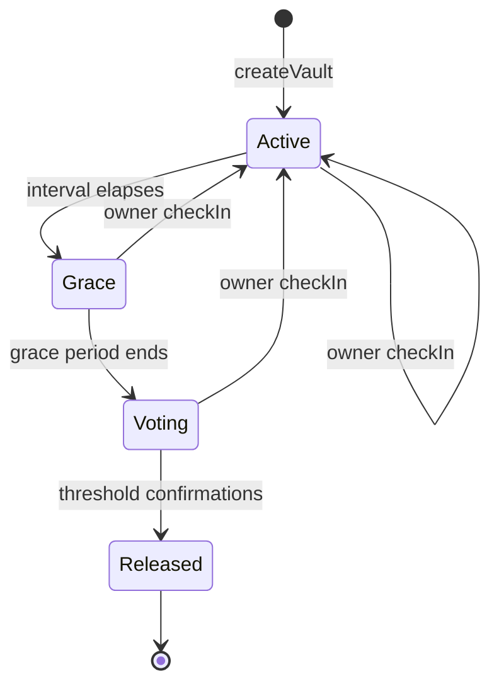
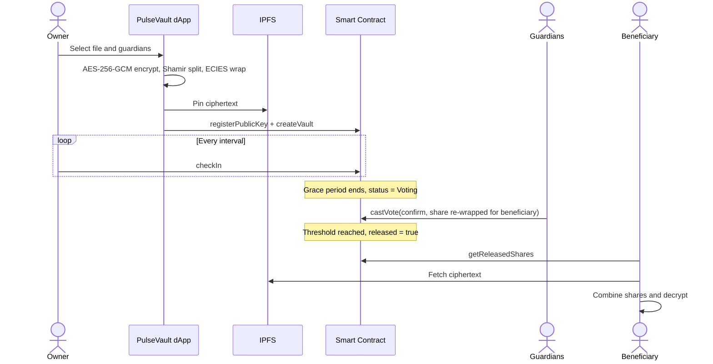

<div align="center">


<a href="https://github.com/tarunt-07/PulseVault">
  
</a>

<br/>


### 💓 A decentralized digital will. A dead man's switch that lives on-chain.

**[Overview](#-what-is-pulsevault)** · **[How It Works](#-how-it-works)** · **[Features](#-features)** · **[Architecture](#-architecture)** · **[Tech Stack](#-tech-stack)** · **[Getting Started](#-getting-started)** · **[Contract](#-contract-interface)** · **[Roadmap](#-roadmap)** · **[Team](#-team)**

</div>

---

## 🧠 What is PulseVault?

Billions in crypto and countless irreplaceable files are lost forever when their owner passes away: lost seed phrases, locked drives, forgotten passwords.

**PulseVault** fixes this with a **blockchain smart contract acting as a dead man's switch**:

- 🔐 Your files are **encrypted in your browser** (AES-256-GCM) and your key never leaves the vault in the clear.
- 💓 You **check in on a schedule** to prove you're alive. As long as you do, the vault stays sealed and private.
- ⏳ If the timer expires, a **pre-selected group of trusted guardians** votes on whether you have passed away.
- ✅ Once guardians reach the threshold, the contract **releases the wrapped key shares exclusively to your chosen beneficiary**, who reconstructs the key and decrypts the files.

No lawyers. No middlemen. No single point of failure. Just code that keeps its promise.

---

## ⚡ How It Works

| Step | Who | What happens |
|:---:|:---|:---|
| **1** | 🧑 Owner | Uploads a file, which is **encrypted client-side** (AES-256-GCM) and pinned to IPFS |
| **2** | 🧑 Owner | Picks a **beneficiary**, **guardians**, a **threshold** and a **check-in interval** |
| **3** | 🧑 Owner | The file key is **Shamir-split** into shares and each share is **ECIES-wrapped to a guardian's key** |
| **4** | 🧑 Owner | Calls `checkIn()` regularly; each check-in **resets the timer** and starts a new round |
| **5** | 🛡 Guardians | After the interval + grace period they vote; a confirm re-wraps their share to the beneficiary |
| **6** | 🎁 Beneficiary | At threshold the vault is **released**; they combine the shares and decrypt the file |

### 🔄 Vault lifecycle



States are derived on-chain from `lastCheckIn + interval` and `gracePeriod`, so
`Active → Grace → Voting` needs no transaction. Any `checkIn()` before release
returns the vault to `Active`.

### 📡 End-to-end flow



---

## ✨ Features

- 💓 **Dead man's switch**: configurable interval enforced by the smart contract
- 🛡 **Guardian consensus**: M-of-N voting so no single guardian can trigger a release
- 🎯 **Beneficiary-only recovery**: released shares are wrapped to the beneficiary's public key
- 🔒 **Client-side encryption**: AES-256-GCM; plaintext never leaves the browser
- 🧩 **Shamir Secret Sharing**: the file key is split into per-guardian shares
- 🔑 **ECIES key wrapping**: secp256k1 ECDH → HKDF-SHA256 → AES-256-GCM
- 🌐 **Decentralized storage**: encrypted blobs live on IPFS (Pinata), with a localStorage fallback
- ⏱ **Grace period**: a buffer after expiry that protects against accidental triggers
- ↩ **Owner override**: checking in at any point before release cancels the vote
- 📜 **Transparent and auditable**: every check-in, vote and release is an on-chain event

---

## 🧱 Architecture

```text
┌──────────────┐   encrypt   ┌────────────────────┐   ciphertext   ┌─────────┐
│   Owner UI   │ ──────────▶ │ Web Crypto AES-GCM │ ─────────────▶ │  IPFS   │
│ (React/Vite) │             └─────────┬──────────┘                └─────────┘
└──────┬───────┘             Shamir + ECIES │
       │ ethers.js                          ▼ wrapped shares
       ▼                          ┌──────────────────────────┐
┌────────────────────────────────│  PulseVault Smart Contract│
│  checkIn · castVote · rekey    │  statusOf · release logic │
└──────────────┬─────────────────└────────────┬─────────────┘
               │ events                        │ getReleasedShares
               ▼                               ▼
        ┌──────────────┐                ┌──────────────┐
        │  Guardians   │                │ Beneficiary  │
        └──────────────┘                └──────────────┘
```

### 🔐 Security model

- The **file key is never stored in plaintext**. It is Shamir-split, and every
  share is **ECIES-wrapped** to a guardian's public key before it goes on-chain.
- Guardians **never see the file or the reconstructed key**. A confirm only
  re-wraps their own share for the beneficiary.
- Release needs a **threshold of guardians**, and the owner can cancel at any
  time before release by checking in.
- See [`docs/security.md`](./docs/security.md) for the full threat model.

> **Disclaimer:** PulseVault is an academic prototype built for learning. It is **unaudited**, so use **testnets only** and do not store real funds or sensitive secrets.

---

## 🧰 Tech Stack

| Layer | Technology |
|:---|:---|
| 📜 Smart Contracts | Solidity 0.8.24, Hardhat |
| 🌐 Frontend | React 18, Vite, plain CSS |
| 🔗 Web3 | ethers.js v6, MetaMask (EIP-1193) |
| 🔐 Encryption | Web Crypto (AES-256-GCM), @noble/curves (secp256k1 ECIES), @noble/hashes (HKDF), Shamir Secret Sharing |
| 📦 Storage | IPFS (Pinata) with localStorage fallback |
| 🧪 Testing | Hardhat, Chai, Mocha + Node's built-in test runner |
| ⛓ Network | Ethereum Sepolia Testnet / Hardhat localhost |

---

## 📁 Project Structure

```text
PulseVault/
├── contracts/
│   └── PulseVault.sol          # Dead man's switch + guardian voting
├── test/
│   └── PulseVault.test.js      # 30 contract tests
├── scripts/
│   └── deploy.js               # Deploy + optional Etherscan verification
├── frontend/
│   ├── index.html
│   ├── vite.config.js
│   └── src/
│       ├── App.jsx
│       ├── components/         # Owner / Guardian / Beneficiary panels
│       └── lib/
│           ├── crypto.js       # AES-GCM + ECIES + share orchestration
│           ├── shamir.js       # Shamir Secret Sharing over GF(256)
│           ├── keys.js         # Wallet-signature key derivation
│           ├── ipfs.js         # Pinata upload/fetch (+ localStorage)
│           ├── contract.js     # ethers bindings
│           └── abi.js          # ABI + status constants
├── docs/
│   ├── architecture.md
│   ├── security.md
│   └── deployment.md
├── hardhat.config.js
├── .env.example
└── README.md
```

---

## 🚀 Getting Started

### Prerequisites

- Node.js 18+
- MetaMask (or another EIP-1193 wallet)
- Optional: a Pinata account for real IPFS pinning (without it, encrypted blobs are kept in browser localStorage for single-device demos)

### Installation

```bash
# 1. Clone the repo
git clone https://github.com/tarunt-07/PulseVault.git
cd PulseVault

# 2. Install root + frontend dependencies
npm install
cd frontend && npm install && cd ..

# 3. Configure environment
cp .env.example .env                     # SEPOLIA_RPC_URL, PRIVATE_KEY, ETHERSCAN_API_KEY
cp frontend/.env.example frontend/.env   # VITE_CONTRACT_ADDRESS, VITE_PINATA_JWT
```

### Compile, test and deploy

```bash
npx hardhat compile
npx hardhat test

# local demo
npx hardhat node                                   # terminal A
npx hardhat run scripts/deploy.js --network localhost   # terminal B

# or Sepolia
npx hardhat run scripts/deploy.js --network sepolia
```

Copy the printed address into `frontend/.env` as `VITE_CONTRACT_ADDRESS`.

### Run the frontend

```bash
cd frontend && npm run dev
```

Open http://localhost:5173. The app has three tabs — **Owner**, **Guardian**
and **Beneficiary**. Full walkthrough in [`docs/deployment.md`](./docs/deployment.md).

### Testing

```bash
npx hardhat test                 # 30 contract tests
cd frontend && npm test          # 5 crypto round-trip tests
```

---

## 📜 Contract interface

`contracts/PulseVault.sol`

| Function | Caller | Purpose |
|:---|:---|:---|
| `registerPublicKey(bytes)` | Any account | Publish the encryption public key used to wrap shares |
| `createVault(address beneficiary, address[] guardians, uint8 threshold, uint64 interval, uint64 gracePeriod, string cid, bytes[] encryptedGuardianShares)` | Owner | Configure the vault and store wrapped shares |
| `checkIn()` | Owner | Prove liveness; reset the timer and open a new round |
| `castVote(address owner, bool confirm, bytes shareForBeneficiary)` | Guardian | Confirm (with a re-wrapped share) or reject during `Voting` |
| `rekey(string cid, bytes[] shares)` | Owner | Rotate the file key and shares; reset the round |
| `getVault(address owner)` | Anyone | Full vault state |
| `getGuardianShare(address owner, address guardian)` | Anyone | A guardian's wrapped share (still encrypted) |
| `getReleasedShares(address owner)` | Anyone | Confirmed shares once released |
| `getVotes(address owner)` | Anyone | Confirms, rejects and voters for the current round |
| `statusOf(address owner)` / `secondsUntilExpiry(address owner)` | Anyone | Derived status and timing |

---

## 🧭 Roadmap

- [x] Finalize architecture and contract design
- [x] Smart contract: vault creation and check-in timer
- [x] Smart contract: guardian voting and threshold logic
- [x] Smart contract: beneficiary release and share claim
- [x] Full test suite with edge cases (30 contract + 5 crypto tests)
- [x] Client-side encryption and key wrapping (AES-GCM + ECIES + Shamir)
- [x] IPFS upload and retrieval (Pinata + localStorage fallback)
- [x] Frontend dashboard for owner, guardian and beneficiary
- [ ] Check-in reminders by email or Telegram
- [ ] Sepolia deployment and live demo
- [ ] Project report and presentation

---

## 👥 Team

| Name | Registration No. | GitHub |
|:---|:---:|:---|
| Tarunkumar.T | 25BCE5705 | [@tarunt-07](https://github.com/tarunt-07) |
| vishwasainath | 25BCE5627 | [@viswasainath](https://github.com/viswasainath) |
| Rakshitha | 25BCE5485 | [@rakshithaarvind2007-cpu](https://github.com/rakshithaarvind2007-cpu) |

Built at **VIT Chennai**, B.Tech Computer Science and Engineering.

---

## 🤝 Contributing

Ideas, issues and PRs are welcome. Fork the repo, create a branch such as `feat/your-feature`, commit using [Conventional Commits](https://www.conventionalcommits.org/) and open a pull request.

## 📄 License

Distributed under the **MIT License**. See [`LICENSE`](./LICENSE) for details.

---

<div align="center">

### 💓 If PulseVault resonates with you, drop a ⭐ to keep the heartbeat going.


</div>
